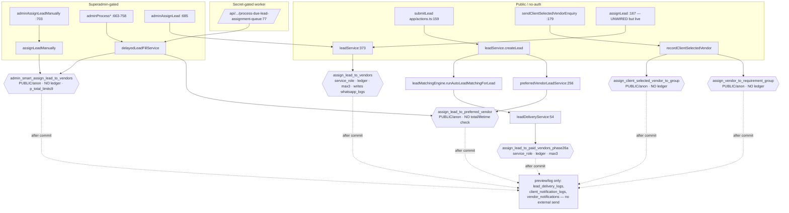
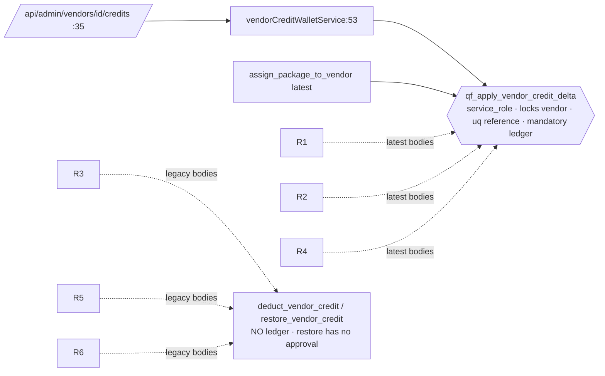

# QF-MVP-20.1 — Marketplace Authority Consumer & Call-Path Audit

**Branch:** `mvp/qf-mvp-20-marketplace-engine-v1` · **Type:** READ-ONLY repository audit + documentation. No runtime code, migration, DB, staging, or provider access.
**Evidence baseline:** the QF-MVP-10 docs + QF-MVP-20.0 design docs. **No production was re-queried.** Every material finding below carries a `file:line` anchor (§20 appendix). Live-DB facts are taken only from the recorded QF-MVP-10 reconciliation.

## 1. Audit scope & method

Purpose: identify every repository consumer, call path and mutation path that can affect lead assignment, assignment limits, vendor eligibility, credits, package lead balances, credit restoration, replacements, bad-lead refunds, assignment communication, and public vendor commercial-data exposure — so that no authority is revoked or replaced before its consumers are known.

Method: repository grep + targeted reads of every `.rpc(` call site, every `.from("<authoritative table>").{insert|update|upsert|delete}`, all ten named RPCs, the assignment-limit constants, the eligibility evaluators, the credit/package mutation paths, the communication side-effects, the public vendor projection, and the AOS/n8n clusters. Four parallel sub-audits (eligibility, public-data, credit/restoration, communication+AOS) corroborated the direct reads. Comments were never treated as proof of runtime behavior — only code and grants.

**Classifications used** (exactly one per path): `ACTIVE_BLOCKER`, `ACTIVE_MIGRATE`, `ACTIVE_SAFE`, `TEST_ONLY`, `MIGRATION_ONLY`, `DORMANT_KEEP_DISABLED`, `DEAD_CANDIDATE`, `UNKNOWN_REQUIRES_PROOF`.

## 2. Repository baseline

- Branch `mvp/qf-mvp-20-marketplace-engine-v1` @ `a06012962e768d633c3b0212f81fb18ae31524c8`; tracked tree clean at audit start.
- Runtime surfaces: 30 API routes (`app/api/**/route.ts`), 1 server-action module (`app/actions.ts`), 23 pages, 64 services, `lib/**` (incl. dormant `lib/aos/**`), 1 edge function (`supabase/functions/whatsapp-dispatch`), 68 SQL migrations (`supabase/migrations/**`) + a legacy pre-migration mirror (`db/001..007_*.sql`, unreferenced by runtime).

## 3. Supabase client inventory (trust audit)

| Factory | File:line | Key / env | Trust | Client-importable? | Used by |
|---|---|---|---|---|---|
| `adminClient()` | `lib/supabase.ts:33-35` | `SUPABASE_SERVICE_ROLE_KEY` (service-role, bypasses RLS) | **service-role** | No — server-only env, throws if key absent; not `NEXT_PUBLIC_` | ALL privileged writes + every assignment/credit RPC |
| `publicClient()` | `lib/supabase.ts:38-40` | `NEXT_PUBLIC_SUPABASE_ANON_KEY` | anon | server-side use | `get_public_eligible_vendors` (`leadService.ts:347`) |
| `serverClient()` | `lib/supabase.ts:43-57` | anon key + request cookies → `auth.uid()` + RLS | authenticated user (cookie-bound) | server-only (uses `next/headers`) | auth guards `currentUser`/`requireVendorOwner`; owner reads (`getMyVendor`) |
| `browserClient()` | `lib/supabaseBrowser.ts:5-10` | `NEXT_PUBLIC_*` anon | browser anon | yes (auth only) | sign-in/out/session only |
| offline scripts | `scripts/*.mjs` (e.g. `grant-superadmin.mjs:43`, `seed-canonical-categories.mjs:38`) | own service-role client | operational, not runtime | n/a | manual ops — **TEST_ONLY/operational** |
| edge fn | `supabase/functions/whatsapp-dispatch/index.ts:17-19` | Deno env service-role | edge (separate deploy) | n/a | drains `whatsapp_logs` → Meta |

**Trust findings:**
- Every assignment + credit RPC is invoked with **`adminClient()` (service-role)** — so the *app* path is server-privileged; caller authorization must therefore be proven **before** the call, in the route/action (§4).
- The service-role client is constructed **only** in `lib/supabase.ts:34` for runtime (plus offline scripts + the edge fn). No runtime module builds an ad-hoc service-role client.
- Minor: `services/vendorService.ts:131` logs `Boolean(process.env.SUPABASE_SERVICE_ROLE_KEY)` (existence boolean, not the value) — code smell, not a leak.
- **Public vendor reads use `adminClient()` + `select("*")`** (`publicVendorService.ts:144,234`) rather than `publicClient()` — safe only because a manual whitelist DTO narrows the row (§13); there is no RLS backstop on that route.

## 4. External runtime entry-point inventory (with authorization)

Authorization helpers: `currentUser()` (`app/actions.ts:60-70`, session via `serverClient`), `requireAdmin()` (`:72-76`, role=admin), `requireSuperadmin()` (`:78-82`, admin + `adminRole==="Superadmin"`), `requireVendorOwner()` (`:106-115`), **`asAdmin()` wraps `requireSuperadmin()`** (`:536-539`). **Middleware** (`middleware.ts:6-37`) redirects only *unauthenticated* users away from `/admin/*` pages and `/vendor/dashboard`; it does **not** check role and does **not** cover `/api/*`. **Route-folder location is not protection** — authorization is entirely in-handler.

| Entry point | File:line | Auth | Reaches | Class |
|---|---|---|---|---|
| `assignLead` (server action) | `app/actions.ts:167` | **PUBLIC (no auth)**; no lead-ownership | `leads.assignLeadToVendors` → `assign_lead_to_vendors` | **ACTIVE_BLOCKER** (auth gap; no UI caller found but a live action endpoint) |
| `sendClientSelectedVendorEnquiry` | `app/actions.ts:179` (UI `ClientSelectedVendorEnquiry.tsx:68`) | **PUBLIC (no auth)**; creates the lead in-flow | `recordClientSelectedVendor` → `assign_client_selected_vendor_to_group` / `assign_vendor_to_requirement_group` | **ACTIVE_MIGRATE** (public path to un-ledgered blocker RPCs) |
| `submitLead` | `app/actions.ts:159` (UI 4 forms) | PUBLIC (intended) | `leads.createLead` → auto-match → `assign_lead_to_paid_vendors_phase26a` | ACTIVE_MIGRATE (funnel) |
| `adminAssignLead` | `app/actions.ts:685` | `asAdmin`=superadmin | `assign_lead_to_vendors` (admin) | ACTIVE_MIGRATE |
| `adminAssignLeadManually` | `app/actions.ts:703-706` (UI `ManualLeadAssignmentPanel.tsx:229`) | `asAdmin`+`requireSuperadmin` | `assignLeadManually` → `admin_smart_assign_lead_to_vendors` (**p_total_limit up to 9**) | **ACTIVE_BLOCKER** (un-ledgered + 9-cap) |
| `adminProcessDueLeadAssignmentQueue` | `app/actions.ts:663-666` | `asAdmin`+`requireSuperadmin` | delayed-fill worker | ACTIVE_MIGRATE |
| `POST /api/admin/process-due-lead-assignment-queue` | `route.ts:70-101` | **shared secret** `x-qf-cron-secret`==`QF_CRON_SECRET` (prod fail-closed; dev mock) | `processDueLeadAssignmentQueue` → `admin_smart_assign` + `assign_lead_to_preferred_vendor` | ACTIVE_MIGRATE |
| `adminProcessDueRequirementAutoFills` / `…AutoFill` / `…PreferredVendorWindow` / `…RechargeWindows` | `app/actions.ts:721-758` | `asAdmin`+`requireSuperadmin` | requirement-group RPCs | ACTIVE_MIGRATE |
| `adminApproveBadLead` | `app/actions.ts:606` → `adminService.approveBadLeadReport` | `asAdmin`=superadmin | `bad_lead_reports.update({credit_restored:false})` — **no refund** | ACTIVE_SAFE (no credit effect) |
| `POST /api/admin/vendors/[id]/credits` | `credits/route.ts:14,35` | `isSuperadmin` | `qf_apply_vendor_credit_delta` (canonical) | ACTIVE_SAFE |
| `POST /api/admin/lead-assignment-approval` / `-preview` | routes `:27-28` / `:21-22` | `isSuperadmin` | `leadAssignmentApprovalService` (**preview only**, writes `lead_assignment_approvals`) | ACTIVE_SAFE (preview) |
| `app/api/aos/process-lead|whatsapp-status|failure|events` | routes | n8n secret; prod fail-closed | AOS mock/preview (no persist) | DORMANT_KEEP_DISABLED (inert) |

## 5. Canonical end-to-end call-path diagrams

Credit authority (canonical, isolated):

## 6. Legacy RPC consumer matrix

| RPC | Direct `.rpc()` consumers (file:line) | Client | Actor source | Ledger | Grant risk (QF-MVP-10) | Class | Canonical replacement |
|---|---|---|---|---|---|---|---|
| `assign_lead_to_paid_vendors_phase26a` | `leadDeliveryService.ts:54` | service-role | system (auto-match) | mandatory (latest body) | service_role-only | ACTIVE_MIGRATE (STRONG_CANONICAL_BASE) | `qf_assign_lead_vendors_v2` `automatic` |
| `assign_lead_to_vendors` | `leadService.ts:373` | service-role | `assignLead`(public)/`adminAssignLead`(superadmin) | mandatory (latest) | service_role-only; **writes `whatsapp_logs`** | ACTIVE_MIGRATE (+ ACTIVE_BLOCKER entry `assignLead`) | v2 `admin_manual`/`client_selected` + comms intent |
| `admin_smart_assign_lead_to_vendors` | `manualLeadAssignmentService.ts:471`, `delayedLeadFillService.ts:444` | service-role | superadmin / cron secret | **NONE** (legacy debit) | **PUBLIC/anon** exec, clamp 1–9 | **ACTIVE_BLOCKER** | v2 `admin_manual`/`delayed_fill` |
| `assign_client_selected_vendor_to_group` | `clientRequirementGroupService.ts:619` | service-role | public (in-flow lead) | **NONE** | **PUBLIC/anon** exec | **ACTIVE_BLOCKER** | v2 `client_selected` |
| `assign_vendor_to_requirement_group` | `clientRequirementGroupService.ts:371` | service-role | public / superadmin | **NONE** | **PUBLIC/anon** exec | **ACTIVE_BLOCKER** | v2 `client_selected`/`admin_manual` |
| `assign_lead_to_preferred_vendor` | `preferredVendorLeadService.ts:256`, `delayedLeadFillService.ts:425` | service-role | public funnel / cron | mandatory (latest) | **PUBLIC/anon** exec; no total/lifetime/full-compat | **ACTIVE_BLOCKER** | v2 `client_selected` |
| `qf_apply_vendor_credit_delta` | `vendorCreditWalletService.ts:53` | service-role | `updatedBy` param | mandatory | service_role-only | **ACTIVE_SAFE** (canonical base) | keep / fold into v2 credit authority |
| `deduct_vendor_credit` | *(no `.rpc()`)* — called inside legacy RPC bodies | — | — | none | invoked by B1–B4 bodies | **MIGRATION_ONLY** (indirect, load-bearing) | retire after RPC bodies replaced |
| `restore_vendor_credit` | *(no `.rpc()`)* — internal race-rollback only | — | — | none; **no approval** | invoked by legacy bodies | **MIGRATION_ONLY** | approval-gated restoration authority |
| `increment_vendor_credits` | *(no `.rpc()`)* | — | — | none | legacy `assign_package_to_vendor` path | **MIGRATION_ONLY** | canonical grant via `qf_apply_vendor_credit_delta` |

> **Deploy-ordering caveat:** migrations `20260706000141–145` (the ledger-backed bodies of the "mandatory-ledger" RPCs) are `DO-NOT-AUTO-APPLY` and per QF-MVP-10 are **NOT applied live**. If unapplied, the runtime-resolved bodies of `assign_lead_to_paid_vendors_phase26a` / `assign_lead_to_vendors` / `assign_lead_to_preferred_vendor` are the **legacy un-ledgered** versions — consistent with the 27/46 ledger gap. **UNKNOWN_REQUIRES_PROOF** until the live body MD5s (already captured in QF-MVP-10 §D) are matched to the applied set.

## 7. Direct table-mutation matrix (authoritative tables)

| Table | Runtime writers (file:line) | Kind | Notes |
|---|---|---|---|
| `lead_assignments` | rows/`assignment_type`/`credit_deducted` written **only inside assignment RPCs** (SQL). TS updates: `vendorService.ts:308` (`vendor_status`), `:376,:459` + `adminService.ts:602` + `adminAuditService.ts:195` (`is_bad_lead_reported`) | insert via RPC; TS = flag updates | no TS writes `assignment_type`/`credit_deducted` |
| `leads` | `adminService.ts:448` (`status`, superadmin); `app/actions.ts:210,248` + `clientRequirementGroupService.ts:692,714` (`preferred_vendor_status`/`requirement_group_id`, public+worker) | update | status lifecycle |
| `vendors` | status: `adminService.ts:471`, `vendorAdminService.ts:118`; profile: `vendorProfileChangeService.ts:165`; **package metadata**: `vendorAdminService.ts:221-227`. **`remaining_credits`/`total_credits` — NO direct TS write** (RPC-only) | update | credits never mutated by direct TS |
| `vendor_credit_logs` | **NO direct TS write** — written only by `qf_apply_vendor_credit_delta` + latest assignment RPC bodies | — | ledger authority intact at TS layer |
| `vendor_packages` | `remaining_leads`/`status` burned/restored **only** via legacy `deduct/restore_vendor_credit`; minted by `assign_package_to_vendor` | RPC-only | Phase-4 debit RPCs don't touch it |
| `bad_lead_reports` | insert `vendorService.ts:450,452`; update `adminService.ts:594` | insert/update | `credit_restored:false` |
| `lead_assignment_approvals` | insert `lib/aos/runtime/leadAssignmentApprovalService.ts:364` | insert | **preview snapshot** (superadmin), not an assignment |
| `client_requirement_groups` | `clientRequirementGroupService.ts:479,503,562,686,708,975,982` | update | group lifecycle |
| `lead_assignment_queue` | `delayedLeadFillService.ts:547,576` | update | queue lifecycle |
| `whatsapp_logs` | **NO runtime TS write**; inserted only inside `assign_lead_to_vendors` SQL (`20260620000003_functions.sql:295,313`; `20260706000144:161,177`); drained by edge fn `whatsapp-dispatch/index.ts:55,59,63` | RPC insert + edge update | the comms-in-transaction defect |

## 8. Assignment-limit constant matrix

| Symbol / literal | File:line | Purpose | Active? | Caller-controlled? | Active vs lifetime | Target |
|---|---|---|---|---|---|---|
| `MAX_VENDORS_PER_LEAD = 3` | `lib/config.ts:106` | active cap mirror | yes | no | active | keep = 3 (internal const) |
| `NORMAL_PRIMARY_VENDOR_LIMIT = 3` | `lib/config.ts:112` | primary/group cap | yes | no | active | keep = 3 |
| **`ADMIN_MANUAL_TOTAL_VENDOR_LIMIT = 9`** | `lib/config.ts:113` | admin recovery total | **yes** | passed as `p_total_limit` | **total/lifetime** | **REJECTED → 6** |
| `p_total_limit` (RPC param) | `admin_smart_assign` call `manualLeadAssignmentService.ts:475` (=`ADMIN_MANUAL_TOTAL_VENDOR_LIMIT`/`NORMAL_…` at `:314`); `delayedLeadFillService.ts:448` (=3); `clientRequirementGroupService.ts:376,623` (=3) | caller ceiling; RPC clamps 1–9 | yes | **YES (design flaw)** | mixed | remove caller ceiling; internal const |
| `least(get_setting_int('max_vendors_per_lead',3),3)` | phase26a/manual/credit-wallet SQL (`20260706000142:50`, `…144:45`, `…027:120`, `20260705000130:182`, `…030:47`) | SQL active clamp | yes | via app_settings | active | keep = 3; DB trigger |
| `app_settings.max_vendors_per_lead` seed `3` | `20260620000004_seed_data.sql:38`, `20260701000022:101` | DB setting | **LIVE = 4 (drift)** | admin UI clamps ≤3 (`AdminSectionPage.tsx:1804`, `runtimeSettings.ts:138`) | active | correct to 3 (approved) |
| `selected_vendor_count ≤ 3` | `lead_assignment_approvals` CHECK (`20260630000017`) | preview cap | yes | no | active (preview) | keep |
| `MAX_VENDORS_PER_LEAD=3` (AOS) | `lib/aos/workflows/leadLifecycle/leadLifecycleTypes.ts:22`, `leadLifecycleValidation.ts:159` | dormant kernel | dormant | no | active | DORMANT |

**No `6`-lifetime constant exists anywhere.** The only lifetime cap in code is the rejected `9`.

## 9. Eligibility implementation matrix (8 evaluators — divergent)

| # | Symbol | File:line | Package/paid HARD gate? | public_visibility HARD gate? | Used for real assign? | Class |
|---|---|---|---|---|---|---|
| 1 | `evaluateVendorAutomaticLeadEligibility` (CANONICAL, credits-only) | `lib/vendors/vendorAutomaticEligibility.ts:90-109` | No | No | **YES** (auto-match) | ACTIVE_SAFE (target) |
| 2 | `evaluateVendorLeadAssignmentEligibility` | `lib/vendors/vendorEligibility.ts:138-185` | **YES** | No | preview/manual/fill/groups | ACTIVE_MIGRATE |
| 3 | `evaluateVendorEligibility` | `lib/vendors/vendorEligibility.ts:93-131` | **YES** | No | approval preview + admin badges | ACTIVE_MIGRATE |
| 4 | `evaluateClientSelectedVendorEligibility` | `lib/vendors/vendorEligibility.ts:239-281` | No | **YES (:253-254,261)** ⚠ | client-selected + recharge | **ACTIVE_BLOCKER** (visibility as assign authority) |
| 5 | `evaluatePreferredVendorDirectEligibility` | `services/preferredVendorLeadService.ts:98-126` | No | No | **YES** (preferred) | ACTIVE_MIGRATE |
| 6 | `evaluateVendorContactAccessEligibility` (deprecated) | `lib/vendors/vendorEligibility.ts:194-199` | **YES** | No | dashboard contact reveal (not selection) | ACTIVE_MIGRATE (scope-limit) |
| 7 | `getVendorPublicVisibility` | `lib/vendors/vendorVisibility.ts:20-58` | package = authority (correct: listing) | reads status | **No** (public listing) | ACTIVE_SAFE (correct scope) |
| 8 | `runMatchForge` (AOS) | `lib/aos/agents/engines.ts:221-286` | credits proxy | No | **No** (`AUTO_ASSIGNMENT_ENABLED=false`) | DORMANT_KEEP_DISABLED |

Ranking-only (no gate): `rankVendorsForLead`/`compareCandidates` (`leadMatchingEngine.ts:336-538`), `scoreVendorForLead` (`autoAssignmentEngine.ts:216-233`), `classifyCandidate` (`manualLeadAssignmentService.ts:391-465`), `scoreCandidate` (`delayedLeadFillService.ts:386-403`). Shared category matcher: `lib/vendors/categoryMatching.ts`. **Divergence:** manual/preview/fill paths are *stricter* (package-gated) than the live credits-only auto-match RPC; #4 uniquely (and wrongly) hard-gates on `public_visibility`, contradicting sibling #5.

## 10. Credit mutation & restoration matrix

**Ledger-backed (canonical or mandatory ledger in latest body):**
| # | Path | Symbol → file:line | change_type | Approval |
|---|---|---|---|---|
| A1 | admin credit grant/adjust | `vendorAdminService.ts:144→167` → `qf_apply_vendor_credit_delta` | `admin_credit_grant`/`manual_adjustment` | isSuperadmin |
| A2 | package activation | `packageService.ts:62→66` → `assign_package_to_vendor` (latest → canonical) | `package_purchase` | asAdmin |
| A3 | auto-match debit | `leadDeliveryService.ts:54` (latest body ledger `…142:141-148`) | `lead_assignment_debit` | system |
| A4 | manual/public assign debit | `leadService.ts:373` (latest `…144:152-159`) | `lead_assignment_debit` | none (public) / superadmin |
| A5 | preferred debit | `preferredVendorLeadService.ts:256` (latest `…143:103-110`) | `lead_assignment_debit` | none (public funnel) |
| A6 | **invalid-lead refund — UNWIRED** | `vendorCreditWalletService.ts:93` | `invalid_lead_refund` | **no approval-evidence param** |
| A7 | **package-purchase grant — UNWIRED** | `vendorCreditWalletService.ts:120` | `package_purchase` | — |

**Ledger-BYPASSING (direct balance, NO `vendor_credit_logs`) — violations:**
| # | Path | Symbol → file:line | RPC → legacy primitive |
|---|---|---|---|
| B1 | admin manual assign | `manualLeadAssignmentService.ts:471` | `admin_smart_assign` → `deduct/restore_vendor_credit` (`…031:107,117`) |
| B2 | delayed-fill worker | `delayedLeadFillService.ts:444` | same |
| B3 | requirement-group fill | `clientRequirementGroupService.ts:371` | `assign_vendor_to_requirement_group` → `deduct/restore` (`…032:259,274`) |
| B4 | client-selected enquiry | `clientRequirementGroupService.ts:619` | `assign_client_selected_vendor_to_group` → `deduct/restore` (`…033:110,125`) |

Legacy primitives: `deduct_vendor_credit` (`db/004_functions.sql:76` / `20260620000003:76`), `restore_vendor_credit` (`:109`, **no approval input**), `increment_vendor_credits` (`:65`) — all direct-balance, no ledger.

**Ledger-evidence fields:** present = before/delta/after/reason/actor(`updated_by`)/reference_type/reference_id(idempotency). **Absent everywhere:** dedicated approval-evidence column, actor *role/identity* (free-text tag), original-assignment linkage beyond `reference_id`.

**Restoration:** **no wired path from a bad-lead report to a credit restoration.** `approveBadLeadReport` sets `credit_restored:false` (`adminService.ts:594-600`, asAdmin). `refundCreditForInvalidLead` is **UNWIRED** (consumers: only `vendorCreditWalletService.ts` + `phase4-credit-wallet-harness.ts` — TEST_ONLY). `restore_vendor_credit` runs only as an internal race-rollback inside assignment RPCs, never as an admin refund.

## 11. Replacement implementation inventory

**There is no swap/replacement authority in the repository.** Findings:
- "Replacement" today = **additive recovery**: `manualLeadAssignmentService.assignLeadManually` (recovery mode → total up to **9**, `:314`) and `delayedLeadFillService` top-up to 3 primary.
- **Bad-lead → credit-back is NOT wired** (§10): approval sets `credit_restored:false`; no refund executes.
- No `replacement_requests`/`replacement_approvals` schema, no one-at-a-time lock, no lifetime-unique tracking, no "never reassign an exhausted vendor" logic. `grep replacement/reassign` in services → only comments + delayed-fill.
- Assignment history is **not deleted** by any path (updates set flags/status; rows persist), but there is **no immutable lifetime-vendor model** — lifetime-6 is unenforceable today (only the rejected `9` total exists).
- Concurrency: none — no per-lead replacement lock exists.

→ Replacement is **MISSING** (build in QF-MVP-20 per §D of the design). Do not assume any replacement code exists.

## 12. Communication side-effect matrix

| Path | Effect | In-txn or post-commit | Idempotency / uncertain-outcome | Class |
|---|---|---|---|---|
| `assign_lead_to_vendors` SQL | INSERT `whatsapp_logs` (Pending) — vendor alert + client confirm | **INSIDE assignment txn** (`20260620000003:295,313`; `…144:161,177`) | RPC raises `LEAD_ALREADY_ASSIGNED`; edge fn pulls only `Pending` → no blind resend | **ACTIVE_MIGRATE** (move to intent) |
| edge fn `whatsapp-dispatch` | drains `whatsapp_logs.status='Pending'` → Meta Graph POST | separate deploy | gated on `WHATSAPP_TOKEN`/`PHONE_ID`→503; **no in-repo scheduler** | **UNKNOWN_REQUIRES_PROOF** (deploy/schedule state) |
| auto-match after-commit | `lead_delivery_logs` + `client_notification_logs` (`whatsapp_status:'preview_only'`) | post-commit, sync | already-assigned skip guard (`leadMatchingEngine.ts:212-242`) | ACTIVE_SAFE (preview only) |
| manual/delayed/group after-commit | `deliverLeadToVendorDashboard`/`createVendorLeadWhatsappPreview`/`createVendorNotification`/`createClientAssignedVendorsPreview` | post-commit, sync | **blind `.insert()`** (`leadDeliveryService.ts:84,130,170`, `vendorNotificationService.ts:84`) — may duplicate on re-run | ACTIVE_MIGRATE (idempotency) |
| service layer | **zero** email/SMS/Meta/n8n sends on assignment (grep clean) | — | — | ACTIVE_SAFE |
| `emitLeadCreatedEvent` / `emitLeadAssignmentApprovedEvent` | AOS event, fire-and-forget; no DB/WhatsApp/credit/assign; n8n only if both locks on (off) | post | — | DORMANT_KEEP_DISABLED |

Only `assign_lead_to_vendors` couples comms into the assignment transaction; every other assignment RPC writes no message. This is exactly the boundary QF-MVP-20 §J moves to an atomic intent + post-commit worker. **Meta stays inactive.**

## 13. Public vendor data-exposure matrix

| Surface | Client / select | Forbidden fields in payload | Category |
|---|---|---|---|
| `getPublicVendorsForCategory` → category page | `adminClient` `select("*")` (`publicVendorService.ts:144`) → DTO `mapToPublicVendor` (`:248-305`) → `VendorCards` | **none** | (a) selected-not-serialized |
| `getPublicVendorProfileBySlugOrId` → profile page | `adminClient` `select("*")` (`:234`) → DTO → HTML/`VendorDetailHeader` | **none** | (a) |
| `generateMetadata` (OpenGraph) | derives from mapped `Vendor` | none | safe |
| `app/vendors/page.tsx` | static, no DB | none | safe |
| `app/category/interiors/carpenters/page.tsx` | hardcoded demo array | "Subscription Active" from **fake mock**, no real vendor | (b) mock only |
| `sendClientSelectedVendorEnquiry` / `captureFreeVendorInterest` | load monetization server-side for eligibility, return only IDs/status | none returned | (a) used-not-returned |
| `getMyVendor` | `serverClient` (RLS, `user_id=self`) selects `remaining_credits`,`paid_status`,… | owner-only | (e) intentional owner access |

**Verdict:** the only monetization-adjacent public field is `activePaidPlan: boolean` (binary paid/trial-vs-free; no package name/identity/credits/expiry). **App payloads do not leak.** BUT (aligning with QF-MVP-10 PV-5 **HIGH**): (i) at the **DB grant level, `anon` has `SELECT` on the `vendors` monetization columns** — direct PostgREST reads bypass the app; (ii) the public path relies on a **manual whitelist over `adminClient()`+`select("*")`** with **no RLS backstop** — any future `...row` spread leaks the full row. QF-MVP-20 §I (column-safe view/DTO + grant revoke + no-leak test) fixes both.

## 14. AOS / n8n / automation classification

Master flags all **OFF** (`lib/aos/config/featureFlags.ts:28-32`): `N8N_ENABLED`, `N8N_OUTBOUND_WEBHOOK_ENABLED`, `WHATSAPP_SENDING_ENABLED`, `CREDIT_DEDUCTION_ENABLED`, `AUTO_ASSIGNMENT_ENABLED`.

| Cluster | File | State |
|---|---|---|
| `n8nTool` | `lib/aos/tools/n8nTool.ts` | DORMANT (flag-gated; live routes use only `validateN8nSecret`) |
| `/api/aos/process-lead`, `/whatsapp-status`, `/failure`, `/events` | routes | ACTIVE endpoints, **inert/mock** (secret-gated, `databasePersisted:false`) |
| `/api/admin/aos-runtime-settings` | route | ACTIVE control plane over inert two-lock switch (Lock 1 off → `shouldCallN8n=false`) |
| `leadAssignmentApprovalService` | `lib/aos/runtime/…` | ACTIVE **preview-only** (writes `lead_assignment_approvals`; never assigns/notifies/deducts) |
| `leadDistributionAssignmentAdapter` | `lib/aos/workflows/leadLifecycle/distribution/…:53-64` | **DORMANT** — wraps the real credit boundary `assignLeadToMatchedVendors` but **no live route dispatches the lifecycle kernel** (only `scripts/phase3b` harness imports it) |
| `assignmentLedgerService` | `lib/aos/runtime/…` | ACTIVE **read-only** (admin ledger display) |
| `emitLeadCreatedEvent` | `lib/aos/events/…` | ACTIVE but inert (no side effects) |
| `lib/aos/agents/**`, `kernel`, `workflow`, `memory` | — | DORMANT/foundation |

**All AOS scaffolding = `DORMANT_KEEP_DISABLED`.** Nothing on a live request path can assign or deduct credits; the one adapter that could (`leadDistributionAssignmentAdapter`) has no live caller. **Do not enable in QF-MVP-20.**

## 15. ACTIVE_BLOCKER list

1. **Four PUBLIC/anon-executable SECURITY DEFINER RPCs** (QF-MVP-10 PV-1): `admin_smart_assign_lead_to_vendors`, `assign_client_selected_vendor_to_group`, `assign_vendor_to_requirement_group`, `assign_lead_to_preferred_vendor` — anon/authenticated can invoke directly, bypassing every app gate. Consumers §6.
2. **Un-ledgered credit debits** B1–B4 (§10) — `admin_smart_assign` + the two group RPCs debit via `deduct_vendor_credit` with **no `vendor_credit_logs`** row (violates "every credit mutation needs ledger evidence").
3. **Caller-controlled `p_total_limit` = 9** (`ADMIN_MANUAL_TOTAL_VENDOR_LIMIT`, `lib/config.ts:113`; passed `manualLeadAssignmentService.ts:314→475`) — admin recovery can push a lead to **9** total vendors; RPC clamps only 1–9 → violates locked **6-lifetime**. No 3-active / 6-lifetime DB trigger exists.
4. **`assignLead` public server action** (`app/actions.ts:167`) — no auth, no lead-ownership; can choose arbitrary lead/vendor IDs. (Underlying RPC is ledgered/max-3, but the entry is an authorization defect.)
5. **`evaluateClientSelectedVendorEligibility` hard-gates on `public_visibility`** (`lib/vendors/vendorEligibility.ts:253-254,261`) — public visibility used as an assignment authority; can suppress a client's explicitly-picked vendor.
6. **Public monetization exposure at the DB grant level** (QF-MVP-10 PV-5) — `anon SELECT` on `vendors.{total_credits,remaining_credits,paid_status,package_*}`; app payload is safe-by-convention only, no RLS backstop.

## 16. UNKNOWN_REQUIRES_PROOF list

1. **Which RPC body is live** for `assign_lead_to_paid_vendors_phase26a` / `assign_lead_to_vendors` / `assign_lead_to_preferred_vendor` / `assign_package_to_vendor` — ledgered (migrations 141–145) vs legacy un-ledgered. Migrations are `DO-NOT-AUTO-APPLY`; QF-MVP-10 says not applied. **Resolve by matching live body MD5s (QF-MVP-10 §D/§F) on staging.** Determines whether A2–A5 are actually ledgered.
2. **`whatsapp-dispatch` edge function deploy/schedule state** — could real sends occur? No in-repo scheduler; gated on Meta env. Confirm on staging before trusting "no send".
3. **`assignLead` (167) invocability** — Next.js server actions expose a callable endpoint even without a UI caller; confirm whether the action ID is reachable/discoverable in the deployed bundle.
4. **`app_settings.max_vendors_per_lead` live value** — QF-MVP-10 recorded **4** (drift); reconfirm before correcting to 3.
5. **`db/001..007_*.sql` legacy mirror** — appears unreferenced by runtime; confirm no build/deploy step loads it before treating as `DEAD_CANDIDATE`.

## 17. Safe revoke sequencing (grant restriction)

**Rule:** no `REVOKE EXECUTE` on any of the four blocker RPCs until its consumers (§6) are migrated. Consumers are now **fully mapped** (§6), so the interim step is available:

1. **Interim (no revoke needed):** add route/action-level auth to the only public entries that reach a blocker RPC — gate `sendClientSelectedVendorEnquiry` (creates its own lead; add rate-limit + captcha + lead-ownership binding) and remove/guard `assignLead` (`app/actions.ts:167`). This neutralizes the *app* bypass immediately.
2. Deploy `qf_assign_lead_vendors_v2` (`service_role`-only) on staging.
3. Migrate consumers §18.
4. **Then** `REVOKE EXECUTE ... FROM public, anon, authenticated` on all four blocker RPCs (closes the direct-PostgREST bypass — the residual DB-grant exposure the app cannot fix).
5. Revoke `anon SELECT` on `vendors` monetization columns / force `vendor_public_v`.
6. Deprecate legacy RPCs (bodies retained for rollback); retire legacy credit primitives after B1–B4 consumers move to the canonical credit authority.

## 18. Consumer migration order

1. **Credit authority first** — route B1–B4 through the canonical ledger authority (fold `admin_smart_assign` + the two group RPCs into `qf_assign_lead_vendors_v2` writing mandatory ledger rows). Unblocks §15.2.
2. **Eligibility consolidation** — make preview/manual/fill/group paths consume canonical #1; drop #4's `public_visibility` gate; unify #4/#5 for "client-picked vendor". Callers: `autoAssignmentEngine.ts:68`, `manualLeadAssignmentService.ts:218,398`, `delayedLeadFillService.ts:375`, `clientRequirementGroupService.ts:324,843`, `leadAssignmentApprovalService.ts:242`.
3. **Assignment entry migration** — `submitLead`/auto-match (`leadMatchingEngine`→`leadDeliveryService:54`), `sendClientSelectedVendorEnquiry`→`recordClientSelectedVendor`, `adminAssignLead`/`adminAssignLeadManually`, delayed-fill worker, requirement-group processors, preferred-vendor funnel → all to `qf_assign_lead_vendors_v2` with proven actor context (§B of design).
4. **Comms boundary** — replace the in-RPC `whatsapp_logs` writes (`assign_lead_to_vendors`) and post-commit blind inserts with the atomic communication intent + post-commit worker.
5. **Public projection** — repoint `publicVendorService` reads to `vendor_public_v`/explicit columns; add no-leak test.
6. **Retire** legacy RPCs + primitives after zero-consumer proof + canary.

## 19. QF-MVP-20.2 implementation prerequisites (exact)

Before writing any runtime code / migration in QF-MVP-20.2:
1. **Staging provisioned** (`OPEN_PREREQUISITE`) — no remediation lands on production first.
2. **Live-body MD5 reconciliation** (§16.1) — confirm which assignment/credit RPC bodies are actually live; without it, "ledgered" paths A2–A5 cannot be trusted.
3. **Consumer inventory frozen** — §6 + §7 + §9 + §10 are the authoritative consumer map; treat any newly-found consumer as a blocker to revoke.
4. **Founder decisions confirmed** — 6-lifetime replaces the rejected 9; credit-restoration approval evidence schema; `public_visibility` not an eligibility authority; `max_vendors_per_lead`→3 correction path.
5. **Immutable lifetime-vendor model** designed (§C of design) before any cap enforcement — lifetime-6 cannot be reconstructed from active rows.
6. **No revoke authored** until §17 steps 1–3 are complete and verified on staging.

## 20. Evidence appendix (file:line)

- Clients: `lib/supabase.ts:33,38,43`; `lib/supabaseBrowser.ts:5`.
- Auth: `app/actions.ts:60,72,78,106,536`; `middleware.ts:25,32`; `process-due-lead-assignment-queue/route.ts:45-60,70`.
- Entry actions: `app/actions.ts:159,167,179,250,606,663,685,703,721-758`; UI `components/vendors/ClientSelectedVendorEnquiry.tsx:68`, `components/admin/ManualLeadAssignmentPanel.tsx:229`, `components/{HomeEnquiryForm,LeadFunnel,LeadForm,ClientEnquiryModal}.tsx`.
- RPC call sites: `leadDeliveryService.ts:54`; `leadService.ts:347,373`; `manualLeadAssignmentService.ts:471`; `delayedLeadFillService.ts:425,444`; `preferredVendorLeadService.ts:256`; `clientRequirementGroupService.ts:371,619`; `vendorCreditWalletService.ts:53`; `packageService.ts:66`.
- Limits: `lib/config.ts:106,112,113`; `manualLeadAssignmentService.ts:314,475`; `delayedLeadFillService.ts:448`; `clientRequirementGroupService.ts:376,623`; SQL `20260706000142:50`,`…144:45`.
- Eligibility: `lib/vendors/vendorAutomaticEligibility.ts:90`; `lib/vendors/vendorEligibility.ts:93,138,194,239,253-254,261`; `services/preferredVendorLeadService.ts:98`; `lib/vendors/vendorVisibility.ts:20`; `lib/aos/agents/engines.ts:221`.
- Credit: `vendorCreditWalletService.ts:46,53,93,120`; `vendorAdminService.ts:144,167,202,221`; `packageService.ts:62`; legacy `db/004_functions.sql:65,76,109`; ledger index `20260706000141:30`.
- Restoration/bad-lead: `adminService.ts:586,594-600`; `vendorService.ts:329,404,450`.
- Comms: `20260620000003_functions.sql:295,313`; `20260706000144:161,177`; `supabase/functions/whatsapp-dispatch/index.ts:17,25-30,43,55`; `leadDeliveryService.ts:84,130,170`; `leadMatchingEngine.ts:212-242,265-268`.
- Public data: `publicVendorService.ts:144,234,248-305,261`; `lib/quickfurno-data.ts:12-46`; `app/actions.ts:142-153`.
- AOS: `lib/aos/config/featureFlags.ts:28-32`; `lib/aos/tools/n8nTool.ts:111-117`; `lib/aos/runtime/leadAssignmentApprovalService.ts:16-20,339-364`; `lib/aos/workflows/leadLifecycle/distribution/leadDistributionAssignmentAdapter.ts:53-64`.
