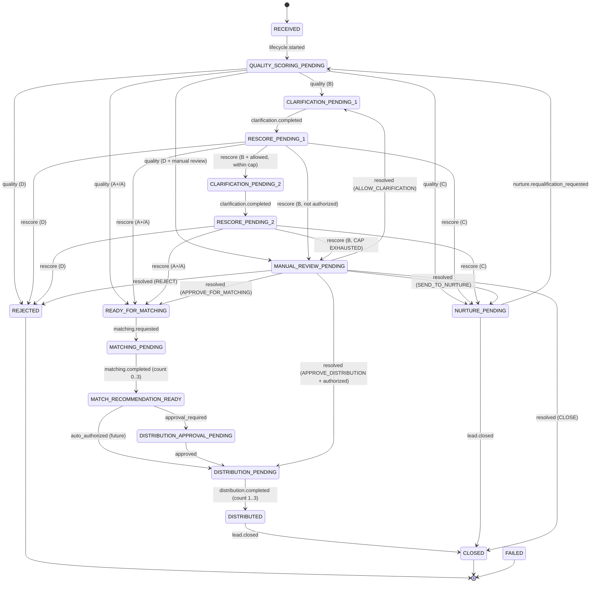

# QF Lead Lifecycle — Phase 2A

> Includes the **targeted lifecycle integrity correction** (2026-07-06): canonical
> lead identity, durable clarification loop protection, manual-review resolution
> contract, the maximum 3-vendor contract guard, and an optional nurture
> requalification path.

## 1. Purpose

Phase 2A defines the **QuickFurno Lead Lifecycle** as a deterministic, declarative
state machine that runs on the generic Workflow Kernel built in Phase 1. It models
the full journey of a qualified client lead — from received, through quality
routing, clarification, matching, distribution approval, and distribution, to its
terminal outcomes.

Phase 2A is **definition only**. It is not connected to the live lead submission
path. It never calculates a quality score, never ranks or queries vendors, never
assigns vendors, never deducts credits, and never sends any external message. The
score, ranking, and assignment all remain the responsibility of the existing
authoritative services and are consumed (in later phases) as authoritative results.

All new code lives under `lib/aos/workflows/leadLifecycle/`.

## 2. Lifecycle Architecture

- **Workflow type:** `qf_lead_lifecycle` (stable; isolated from `qf_kernel_test`).
- **Engine:** the Phase 1 Workflow Kernel (`lib/aos/workflow/`).
- **Handler:** a **pure** function `leadLifecycleHandler(context) -> WorkflowHandlerResult`.
  Given `{ workflow, event, definition, now }` it returns the next state, workflow
  status, reason, metadata, and durable task intents. It performs no I/O.
- **Driving model:** each inbound domain event causes exactly one transition.
  Follow-up work is recorded as a durable **task intent**, not executed inline.
- **Kernel-enforced safety:** the definition's `transitions` map and `terminalStates`
  are validated by the kernel's `validateWorkflowTransition` on every step.

## 3. Canonical Lead Identity Rule (Correction 1)

The generic kernel creates/loads the workflow from `domain_event.entity_id`, so
entity identity — not a caller-supplied `payload.lead_id` — is the source of truth.
`resolveCanonicalLeadIdentity(workflow, event)` runs at the top of the handler for
**every** event and enforces:

1. `event.entity_type` must equal `"lead"` → else `LEAD_ENTITY_TYPE_REQUIRED`.
2. `event.entity_id` must be a non-empty string → else `LEAD_ENTITY_ID_REQUIRED`.
3. `workflow.entity_type` must equal `"lead"` → else `WORKFLOW_ENTITY_TYPE_MISMATCH`.
4. `workflow.entity_id` must equal `event.entity_id` → else `WORKFLOW_EVENT_ENTITY_MISMATCH`.
5. `payload.lead_id` is optional; when present it must be a non-empty string equal
   to `event.entity_id` → otherwise `LEAD_IDENTITY_MISMATCH`.

The canonical lead id used in **task payloads**, **transition metadata**, and
lifecycle decisions is always the validated `event.entity_id`. `payload.lead_id`
is never independently trusted, and a missing `payload.lead_id` never yields a
`null` lead id.

## 4. States

Terminal states: `REJECTED` (status `cancelled`), `CLOSED` (status `completed`),
`FAILED` (status `failed`). `DISTRIBUTED` is intentionally non-terminal so it can
still be `CLOSED`.

| State | Meaning |
| --- | --- |
| `RECEIVED` | Lead received; no scoring yet (initial state). |
| `QUALITY_SCORING_PENDING` | Awaiting an authoritative quality result. |
| `CLARIFICATION_PENDING_1` | B route, clarification round 1. |
| `RESCORE_PENDING_1` | Round 1 answered; awaiting authoritative rescore. |
| `CLARIFICATION_PENDING_2` | B route, clarification round 2 (final round). |
| `RESCORE_PENDING_2` | Round 2 answered; awaiting authoritative rescore. |
| `READY_FOR_MATCHING` | A+/A route: ready to enter matching. |
| `MATCHING_PENDING` | Matching requested; awaiting match result. |
| `MATCH_RECOMMENDATION_READY` | Recommendations ready; awaiting distribution decision. |
| `DISTRIBUTION_APPROVAL_PENDING` | Controlled rollout: awaiting explicit approval. |
| `DISTRIBUTION_PENDING` | Distribution authorized; ready to prepare. |
| `DISTRIBUTED` | Lead delivered to its matched vendors (max 3). |
| `NURTURE_PENDING` | C route: nurtured for future qualification. |
| `MANUAL_REVIEW_PENDING` | Human review required before proceeding. |
| `REJECTED` / `CLOSED` / `FAILED` | Terminal. |

## 5. Event Contracts

Driver events:

| Event | Effect |
| --- | --- |
| `lead.lifecycle.started` | `RECEIVED → QUALITY_SCORING_PENDING` |
| `lead.quality.resulted` | Routes by authoritative tier (see §7) |
| `lead.clarification.completed` | `CLARIFICATION_PENDING_n → RESCORE_PENDING_n` |
| `lead.matching.requested` | `READY_FOR_MATCHING → MATCHING_PENDING` |
| `lead.matching.completed` | `MATCHING_PENDING → MATCH_RECOMMENDATION_READY` (count-guarded) |
| `lead.distribution.approval_required` | `MATCH_RECOMMENDATION_READY → DISTRIBUTION_APPROVAL_PENDING` |
| `lead.distribution.approved` | `DISTRIBUTION_APPROVAL_PENDING → DISTRIBUTION_PENDING` |
| `lead.distribution.auto_authorized` | `MATCH_RECOMMENDATION_READY → DISTRIBUTION_PENDING` (future capability) |
| `lead.distribution.completed` | `DISTRIBUTION_PENDING → DISTRIBUTED` (count-guarded) |
| `lead.manual_review.required` | `* → MANUAL_REVIEW_PENDING` (where the map permits) |
| `lead.manual_review.resolved` | `MANUAL_REVIEW_PENDING → outcome destination` (see §8) |
| `lead.nurture.requalification_requested` | `NURTURE_PENDING → QUALITY_SCORING_PENDING` (see §9) |
| `lead.rejected` | `* → REJECTED` (where the map permits) |
| `lead.closed` | `* → CLOSED` (where the map permits) |

Contract-only events (modeled as task intents): `lead.quality.scoring_requested`,
`lead.rescore.requested`, `lead.nurture.scheduled`.

## 6. Durable Clarification Loop Protection (Correction 2)

The clarification cap is enforced **structurally by durable state**, not by a
caller-resettable event counter. `MAX_CLARIFICATION_CYCLES = 2` (a loop-safety
guard, **not** a scoring threshold) sizes exactly two bounded rounds.

Exact round model:

1. Initial tier B (from `QUALITY_SCORING_PENDING`) → `CLARIFICATION_PENDING_1`.
2. `CLARIFICATION_PENDING_1` + `clarification.completed` → `RESCORE_PENDING_1`.
3. Rescore tier B from `RESCORE_PENDING_1` → `CLARIFICATION_PENDING_2` **only if**
   the authoritative event sets `clarification_allowed = true` (round 2 is within
   the cap); otherwise → `MANUAL_REVIEW_PENDING`.
4. `CLARIFICATION_PENDING_2` + `clarification.completed` → `RESCORE_PENDING_2`.
5. Rescore tier B from `RESCORE_PENDING_2` → **always** `MANUAL_REVIEW_PENDING`
   (the cap is exhausted), regardless of `clarification_allowed` or any payload
   counter, with metadata `loop_safety_applied: true`.

The current clarification round is derived from the durable workflow state
(`RESCORE_PENDING_1` → round 1, `RESCORE_PENDING_2` → round 2). The authoritative
`clarification_cycle` field is validated for payload hygiene (non-negative integer)
but is **ignored** for progression. Because `RESCORE_PENDING_2` has **no** outgoing
edge to any clarification state, a third clarification round is impossible by
construction — even the kernel's `validateWorkflowTransition` rejects it.

> Note: a human `lead.manual_review.resolved` with outcome `ALLOW_CLARIFICATION`
> re-enters the bounded sequence at round 1. This is a deliberate, human-gated
> override that requires an explicit resolution event each time; it is not an
> automated loop.

## 7. Quality-Routing Behavior

Phase 2A does not compute a score. It consumes an authoritative
`lead.quality.resulted` payload whose tier is one of the authoritative classes
(`LeadScoreClass`): `A+`, `A`, `B`, `C`, `D`. No new thresholds, no formula.

| Tier | Route |
| --- | --- |
| `A+` / `A` | `READY_FOR_MATCHING` |
| `B` | Bounded clarification per §6 |
| `C` | `NURTURE_PENDING` |
| `D` | `REJECTED`, unless `manual_review_required = true` → `MANUAL_REVIEW_PENDING` |

## 8. Manual Review Resolution Contract (Correction 3)

`lead.manual_review.resolved` carries a strict typed `outcome`. Unknown outcomes
are rejected (`MANUAL_REVIEW_OUTCOME_INVALID`).

| Outcome | Destination |
| --- | --- |
| `APPROVE_FOR_MATCHING` | `READY_FOR_MATCHING` |
| `ALLOW_CLARIFICATION` | `CLARIFICATION_PENDING_1` (human-gated; §6) |
| `SEND_TO_NURTURE` | `NURTURE_PENDING` |
| `APPROVE_DISTRIBUTION` | `DISTRIBUTION_PENDING` — **requires** `distribution_authorized: true` |
| `REJECT` | `REJECTED` |
| `CLOSE` | `CLOSED` |

`APPROVE_DISTRIBUTION` does not blindly bypass distribution safety: it requires
explicit authoritative review metadata (`distribution_authorized = true`), else
`MANUAL_REVIEW_DISTRIBUTION_AUTHORIZATION_REQUIRED`. It remains state-machine-only
— no vendors are assigned and no credits are deducted. `MANUAL_REVIEW_PENDING`'s
outgoing transition edges were trimmed to exactly these six destinations (the
previously-modeled `→ FAILED` edge, unreachable via any resolution outcome, was
removed).

## 9. Nurture Requalification Decision

**Decision: added in Phase 2A** (state-machine only). `lead.nurture.requalification_requested`
routes `NURTURE_PENDING → QUALITY_SCORING_PENDING` and re-opens the existing
`lead.quality.score` task intent. Phase 2A does **not** schedule or trigger
nurture, and calls no WhatsApp and no n8n. Each requalification requires an
explicit authoritative event, so it is a controlled business re-entry, not an
automated loop. Actually scheduling/triggering nurture belongs to **Phase 2B**
(task executors and channel integration).

## 10. Maximum 3-Vendor Contract Guard (Correction 4)

Phase 2A performs no matching and no assignment, but it guards the authoritative
result payloads against impossible results using the shared constant
`MAX_VENDORS_PER_LEAD = 3`.

- **`lead.matching.completed`** — `recommended_vendor_count` is required, an
  integer in `[0, 3]`. Errors: `RECOMMENDED_VENDOR_COUNT_REQUIRED`,
  `RECOMMENDED_VENDOR_COUNT_INVALID`.
- **`lead.distribution.completed`** — `distributed_vendor_count` is required, an
  integer in `[1, 3]`. Errors: `DISTRIBUTED_VENDOR_COUNT_REQUIRED`,
  `DISTRIBUTED_VENDOR_COUNT_INVALID`.
- If a vendor-id array (`recommended_vendor_ids` / `distributed_vendor_ids`) is
  included, its length must equal the count (`VENDOR_IDS_COUNT_MISMATCH`); Phase 2A
  never invents vendor ids when not provided.

Negative values, fractions, strings, and counts above 3 are rejected. This is a
contract guard only — the real matching engine, assignment RPC, and credit ledger
are untouched.

## 11. Matching Result Payload Contract

```jsonc
// lead.matching.completed
{ "recommended_vendor_count": 0..3, "recommended_vendor_ids"?: string[] }
```

## 12. Distribution Result Payload Contract

```jsonc
// lead.distribution.completed
{ "distributed_vendor_count": 1..3, "distributed_vendor_ids"?: string[] }
```

## 13. Task Intents & Idempotency

Each work-pending state opens exactly one durable task intent on entry
(`lead.quality.score`, `lead.clarification.prepare`, `lead.quality.rescore`,
`lead.matching.prepare`, `lead.distribution.await_approval`,
`lead.distribution.prepare`, `lead.nurture.prepare`, `lead.manual_review.prepare`).
No executor is implemented. Idempotency keys are deterministic and reproducible
from durable identity only:

```
qf_lead_lifecycle:task:{workflow_instance_id}:{triggering_event_id}:{task_intent}
```

No timestamps, no random values, no UUIDs.

## 14. What Remains Authoritative in Existing Services

Unchanged and authoritative: `services/leadQualityService.ts` (score + `A+/A/B/C/D`
thresholds), `services/leadClarificationService.ts` (clarification behavior),
`services/leadMatchingEngine.ts` (matching + ranking), `services/leadDeliveryService.ts`
(delivery/assignment), `services/leadService.ts` (lead persistence). Phase 2A only
consumes authoritative results.

## 15. Explicit Non-Connection Statements

- **Real lead flow is NOT connected.** Not wired to live submission; not globally
  registered/activated in production runtime.
- **No live matching runs.** No vendor query, ranking, or matching-engine call.
- **No assignments occur.** No assignment RPC, no vendor assignment.
- **Credits are unchanged.** No credit/wallet/ledger read or mutation.
- **WhatsApp is disabled.** No WhatsApp/SMS/email/n8n/Meta command; no provider
  executed.
- **Production n8n is unchanged.**

## 16. Phase 2B Direction

Phase 2B may wire the real lead path to emit `lead.lifecycle.started`, implement
task executors that call the authoritative services, add controlled-rollout
distribution policy, and add actual nurture scheduling/channel integration — each
behind explicit, reviewed activation. None is started in Phase 2A.

## 17. Database Migration Status

**No new migration was created for Phase 2A or for this correction.** The generic
Workflow Kernel stores state names as text and needs no schema change. No migration
was applied to production.

## State Diagram



## Test Coverage

`npm run test:phase2a` runs `scripts/phase2a-lead-lifecycle-harness.mjs`, a
**source/static** harness (69 checks) that compiles the pure lifecycle modules plus
the kernel validators and exercises the deterministic handler, cross-checking every
produced transition against the kernel's own `validateWorkflowTransition` and
`validateHandlerResult`. It is not a database integration test; runtime DB
integration is intentionally deferred to a later phase.
