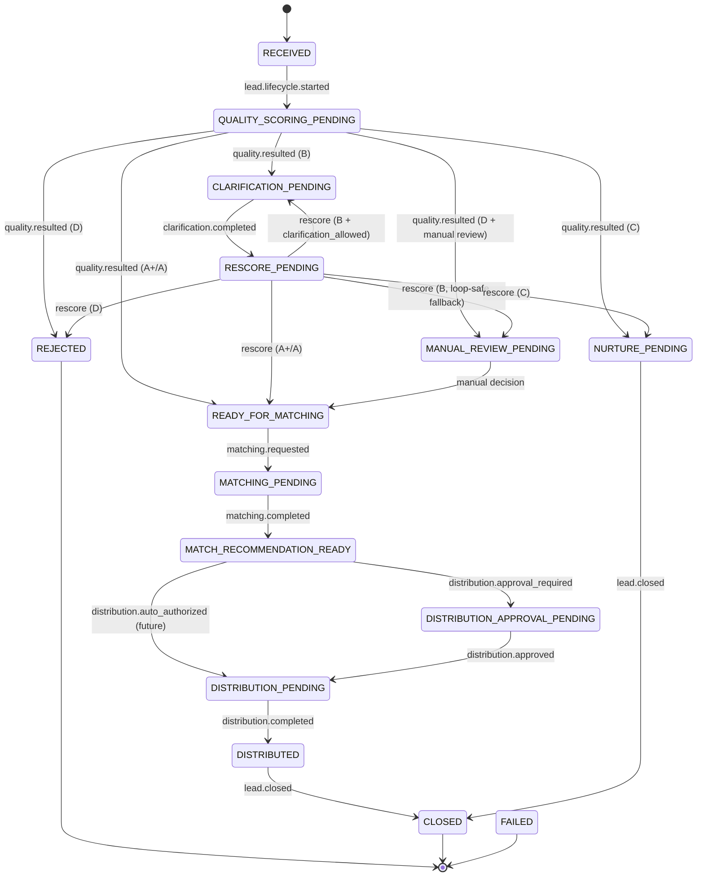

# QF Lead Lifecycle — Phase 2A

## 1. Purpose

Phase 2A defines the **QuickFurno Lead Lifecycle** as a deterministic, declarative
state machine that runs on the generic Workflow Kernel built in Phase 1. It models
the full journey of a qualified client lead — from received, through quality
routing, clarification, matching, distribution approval, and distribution, to its
terminal outcomes.

Phase 2A is **definition only**. It is not connected to the live lead submission
path. It never calculates a quality score, never ranks or queries vendors, never
assigns vendors, never deducts credits, and never sends any external message. The
score, ranking, and assignment all remain the responsibility of the existing
authoritative services and are consumed (in later phases) as authoritative results.

All new code lives under `lib/aos/workflows/leadLifecycle/`.

## 2. Lifecycle Architecture

- **Workflow type:** `qf_lead_lifecycle` (stable; isolated from `qf_kernel_test`).
- **Engine:** the Phase 1 Workflow Kernel (`lib/aos/workflow/`).
- **Handler:** a **pure** function `leadLifecycleHandler(context) -> WorkflowHandlerResult`.
  Given `{ workflow, event, definition, now }` it returns the next state, the
  workflow status, a reason, metadata, and any durable task intents. It performs
  no I/O.
- **Driving model:** each inbound domain event causes exactly one transition. Work
  that must happen next (score, clarify, rescore, match, await approval, prepare
  distribution, nurture, manual review) is recorded as a **durable task intent**,
  not executed inline. An external actor (future phase) completes that work and
  emits the next authoritative event.
- **Kernel-enforced safety:** the definition's `transitions` map and `terminalStates`
  are validated by the kernel's `validateWorkflowTransition` on every step, so an
  illegal transition or any move out of a terminal state is rejected atomically.

Events route to this workflow via `payload_json.workflow_type = "qf_lead_lifecycle"`
(the kernel's `resolveWorkflowType`), so lifecycle events never collide with the
test workflow.

## 3. States

| State | Meaning | Terminal |
| --- | --- | --- |
| `RECEIVED` | Lead received; no scoring yet (initial state). | no |
| `QUALITY_SCORING_PENDING` | Awaiting an authoritative quality result. | no |
| `CLARIFICATION_PENDING` | B route: awaiting client clarification answers. | no |
| `RESCORE_PENDING` | Clarification answered; awaiting authoritative rescore. | no |
| `READY_FOR_MATCHING` | A+/A route: ready to enter matching. | no |
| `MATCHING_PENDING` | Matching requested; awaiting match result. | no |
| `MATCH_RECOMMENDATION_READY` | Recommendations ready; awaiting distribution decision. | no |
| `DISTRIBUTION_APPROVAL_PENDING` | Controlled rollout: awaiting explicit approval. | no |
| `DISTRIBUTION_PENDING` | Distribution authorized; ready to prepare. | no |
| `DISTRIBUTED` | Lead delivered to its matched vendors (max 3). | no |
| `NURTURE_PENDING` | C route: nurtured for future qualification. | no |
| `MANUAL_REVIEW_PENDING` | Human review required before proceeding. | no |
| `REJECTED` | Lead rejected. | **yes** (status `cancelled`) |
| `CLOSED` | Lifecycle closed. | **yes** (status `completed`) |
| `FAILED` | Workflow-level failure. | **yes** (status `failed`) |

`DISTRIBUTED` is intentionally **non-terminal** (workflow status stays `active`) so
it can still transition to `CLOSED`.

## 4. Event Contracts

Driver events (advance state):

| Event | Effect |
| --- | --- |
| `lead.lifecycle.started` | `RECEIVED → QUALITY_SCORING_PENDING` |
| `lead.quality.resulted` | Routes by authoritative tier (see §5) |
| `lead.clarification.completed` | `CLARIFICATION_PENDING → RESCORE_PENDING` |
| `lead.matching.requested` | `READY_FOR_MATCHING → MATCHING_PENDING` |
| `lead.matching.completed` | `MATCHING_PENDING → MATCH_RECOMMENDATION_READY` |
| `lead.distribution.approval_required` | `MATCH_RECOMMENDATION_READY → DISTRIBUTION_APPROVAL_PENDING` |
| `lead.distribution.approved` | `DISTRIBUTION_APPROVAL_PENDING → DISTRIBUTION_PENDING` |
| `lead.distribution.auto_authorized` | `MATCH_RECOMMENDATION_READY → DISTRIBUTION_PENDING` (future capability) |
| `lead.distribution.completed` | `DISTRIBUTION_PENDING → DISTRIBUTED` |
| `lead.manual_review.required` | `* → MANUAL_REVIEW_PENDING` (where the map permits) |
| `lead.rejected` | `* → REJECTED` (where the map permits) |
| `lead.closed` | `* → CLOSED` (where the map permits) |

Contract-only events (declared for a stable contract; modeled as task intents in
Phase 2A rather than re-entrant events): `lead.quality.scoring_requested`,
`lead.rescore.requested`, `lead.nurture.scheduled`.

These are Phase 2A **workflow contracts only**. Nothing in Phase 2A emits these
events into the live application.

## 5. Quality-Routing Behavior

Phase 2A **does not compute** a score. It consumes an authoritative
`lead.quality.resulted` payload whose tier is one of the existing authoritative
classes (`LeadScoreClass` in `services/leadQualityService.ts`): `A+`, `A`, `B`,
`C`, `D`. No new thresholds and no scoring formula are introduced.

| Tier | Route |
| --- | --- |
| `A+` / `A` | `READY_FOR_MATCHING` |
| `B` | `CLARIFICATION_PENDING` (see §6 for loop safety) |
| `C` | `NURTURE_PENDING` |
| `D` | `REJECTED`, unless `manual_review_required = true` → `MANUAL_REVIEW_PENDING` |

Optional routing metadata consumed from the payload: `manual_review_required`
(boolean), `clarification_allowed` (boolean), `clarification_cycle` (non-negative
integer). Any other tier value is rejected — arbitrary score strings are never
accepted.

## 6. Clarification Loop Safety

Clarification can loop (`B → clarify → rescore → B`). To prevent an unbounded
loop, Phase 2A enforces explicit, authoritative semantics:

- The **first** B result (from `QUALITY_SCORING_PENDING`) always routes to
  `CLARIFICATION_PENDING`.
- A B result on **rescore** (from `RESCORE_PENDING`) re-enters
  `CLARIFICATION_PENDING` **only if** the authoritative event sets
  `clarification_allowed = true` **and** `clarification_cycle < MAX_CLARIFICATION_CYCLES`
  (`MAX_CLARIFICATION_CYCLES = 2`, a loop guard — **not** a scoring rule).
- Otherwise the lead is routed to `MANUAL_REVIEW_PENDING` and the decision metadata
  records `loop_safety_applied: true`.

`clarification_cycle` must be a non-negative integer or the payload is rejected.

## 7. Matching Lifecycle

`READY_FOR_MATCHING → (lead.matching.requested) → MATCHING_PENDING → (lead.matching.completed) → MATCH_RECOMMENDATION_READY`.

Phase 2A does not rank vendors, query vendors, call `leadMatchingEngine`, or create
any assignment. The existing **maximum of 3 vendors per lead** rule remains
authoritative and untouched; Phase 2A neither changes nor bypasses it.

## 8. Approval Lifecycle

Initial production direction is a controlled rollout:

`MATCH_RECOMMENDATION_READY → (lead.distribution.approval_required) → DISTRIBUTION_APPROVAL_PENDING → (lead.distribution.approved) → DISTRIBUTION_PENDING`.

Distribution can only leave `DISTRIBUTION_APPROVAL_PENDING` after an explicit
approval event.

## 9. Future Automatic Distribution Capability

The state machine also models an explicit authorization shortcut:

`MATCH_RECOMMENDATION_READY → (lead.distribution.auto_authorized) → DISTRIBUTION_PENDING`.

This is **state-machine capability only**. It does **not** activate automatic
distribution, does **not** implement any policy flag, does **not** assign vendors,
and does **not** deduct credits. The handler emits only a persistence-only
`lead.distribution.prepare` task intent and no outbox/provider command.

## 10. Task Intents

Task intents are durable orchestration markers. Phase 2A implements **no** task
executor. Each "work-pending" state opens exactly one intent on entry:

| State entered | Task intent |
| --- | --- |
| `QUALITY_SCORING_PENDING` | `lead.quality.score` |
| `CLARIFICATION_PENDING` | `lead.clarification.prepare` |
| `RESCORE_PENDING` | `lead.quality.rescore` |
| `MATCHING_PENDING` | `lead.matching.prepare` |
| `DISTRIBUTION_APPROVAL_PENDING` | `lead.distribution.await_approval` |
| `DISTRIBUTION_PENDING` | `lead.distribution.prepare` |
| `NURTURE_PENDING` | `lead.nurture.prepare` |
| `MANUAL_REVIEW_PENDING` | `lead.manual_review.prepare` |

## 11. Idempotency Strategy

Task idempotency keys are deterministic and reproducible from durable identity only:

```
qf_lead_lifecycle:task:{workflow_instance_id}:{triggering_event_id}:{task_intent}
```

No timestamps, no random values, no UUIDs are embedded. Replaying the same event
reproduces the same key, so the Phase 1 atomic-step RPC de-duplicates it.

## 12. Terminal States

`REJECTED` (status `cancelled`), `CLOSED` (status `completed`), and `FAILED`
(status `failed`) are terminal. They have no outgoing edges in the transition map,
and the kernel blocks any transition out of a terminal state or terminal status.
For example, a `REJECTED` lead cannot continue into matching.

## 13. What Remains Authoritative in Existing Services

Unchanged and authoritative:

- `services/leadQualityService.ts` — the score and the `A+/A/B/C/D` thresholds.
- `services/leadClarificationService.ts` — clarification questions/behavior.
- `services/leadMatchingEngine.ts` — the matching algorithm and ranking.
- `services/leadDeliveryService.ts` — delivery/assignment behavior.
- `services/leadService.ts` — lead persistence behavior.

Phase 2A only **consumes** authoritative results; it never re-implements them.

## 14–18. Explicit Non-Connection Statements

- **14. Real lead flow is NOT connected.** The lifecycle is not wired to the live
  lead submission path. Nothing in Phase 2A globally registers or activates it in
  production runtime.
- **15. No live matching runs.** No vendor query, no ranking, no matching-engine call.
- **16. No assignments occur.** No assignment RPC, no vendor assignment.
- **17. Credits are unchanged.** No credit/wallet/ledger read or mutation.
- **18. WhatsApp is disabled.** No WhatsApp/SMS/email/n8n/Meta command is emitted;
  no external provider is executed.

## 19. Phase 2B Direction

Phase 2B may (a) wire the real lead submission path to emit `lead.lifecycle.started`,
(b) implement task executors that call the authoritative services for scoring,
clarification, matching, and distribution, and (c) add controlled-rollout policy
for approval vs. auto-authorization — each behind explicit, reviewed activation.
None of this is started in Phase 2A.

## 20. Database Migration Status

**No new migration was created for Phase 2A.** The generic Workflow Kernel
persistence model already stores state names as text and needs no schema change to
represent the lead lifecycle. No migration was applied to production.

## State Diagram



## Test Coverage

`npm run test:phase2a` runs `scripts/phase2a-lead-lifecycle-harness.mjs`, a
**source/static** harness that compiles the pure lifecycle modules plus the kernel
validators and exercises the deterministic handler, cross-checking every produced
transition against the kernel's own `validateWorkflowTransition` and
`validateHandlerResult`. It is not a database integration test; runtime DB
integration is intentionally deferred to a later phase.
