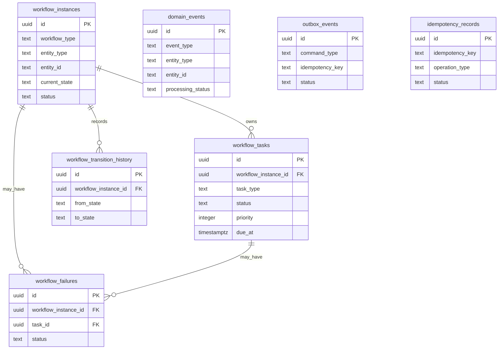

# QF Workflow Kernel v1 - Phase 1A

Phase 1A creates the durable database foundation for a future QuickFurno-owned workflow kernel. It is persistence only: no orchestration engine, no workers, no lead-flow integration, no WhatsApp execution, no production n8n workflow, no AI agent execution, and no changes to matching, scoring, clarification, assignment, credits, client UI, vendor UI, or admin UI.

Migration created:

`supabase/migrations/20260706000146_create_qf_workflow_kernel_foundation.sql`

The migration was created for review and was not automatically applied to production.

## Tables

| Table | Purpose |
| --- | --- |
| `workflow_instances` | One durable record for an active, paused, completed, failed, or cancelled business workflow. |
| `workflow_tasks` | Durable scheduled or immediate units of work for a future worker. |
| `domain_events` | Durable business/domain events emitted by QuickFurno. |
| `outbox_events` | Durable external command outbox for a future integration executor. |
| `workflow_failures` | Safe operational failure summaries. |
| `idempotency_records` | Concurrency-safe duplicate execution guard records. |
| `workflow_transition_history` | Permanent workflow state transition audit trail. |

## Relationship Diagram



## Lifecycle Notes

Task lifecycle:

`pending -> processing -> completed`

Retry path:

`processing -> retry_scheduled -> processing`

Terminal paths:

`processing -> failed`, `processing -> dead_letter`, or any active state to `cancelled`.

Outbox lifecycle:

`pending -> processing -> sent -> completed`

Retry and terminal paths mirror workflow tasks:

`processing -> retry_scheduled -> processing`, then `failed`, `dead_letter`, or `cancelled` when appropriate.

Domain event lifecycle:

`pending -> processing -> processed`

Failures can move to `failed`, and unrecoverable events can move to `dead_letter`.

Dead-letter representation is explicit status, not deletion. Phase 1B should keep failed payloads minimal and safe, then record operational summaries in `workflow_failures`.

## Idempotency Strategy

`idempotency_records.idempotency_key` is globally unique.

The function `qf_begin_idempotent_operation(...)` uses an insert-first pattern:

1. Try `insert ... on conflict do nothing`.
2. If the insert succeeds, return `was_created = true`.
3. If another caller already won, return the existing row with `was_created = false`.

This avoids a check-then-insert race. Future callers should only perform the guarded business operation when `was_created = true`, or should inspect the existing row status/result when `was_created = false`.

Additional object-specific idempotency protection:

- `workflow_tasks.idempotency_key` has a unique partial index for non-null values.
- `domain_events.idempotency_key` has a unique partial index for non-null values.
- `outbox_events.idempotency_key` is required and unique.

## Atomic Claiming Strategy

Workflow tasks are claimed through `qf_claim_due_workflow_task(worker_id, stale_lock_after)`.

The function performs a single atomic `update ... where id = (select ... for update skip locked limit 1) returning *`.

Eligible task rows:

- `status = 'pending'`, or
- `status = 'retry_scheduled' and next_retry_at <= now()`,
- `due_at <= now()`,
- no active lock, where an old pending/retry lock is older than `stale_lock_after`.

Claim update:

- `status = 'processing'`
- `locked_at = now()`
- `locked_by = worker_id`
- `started_at = coalesce(started_at, now())`
- `updated_at = now()`

Task priority convention:

Higher numeric `priority` values are claimed first, then earliest `due_at`, then oldest `created_at`.

Outbox events are claimed through `qf_claim_due_outbox_event(worker_id, stale_lock_after)` using the same `FOR UPDATE SKIP LOCKED` pattern. Because the requested Phase 1A outbox schema does not include `due_at`, pending outbox commands are ordered by oldest `created_at`; retry-scheduled commands are eligible when `next_retry_at <= now()`.

## Stale Lock Recovery Design

Phase 1A does not create a cron job or background unlocker.

The schema supports future crash recovery with:

- `locked_at`
- `locked_by`
- `attempt_count`
- `max_attempts`
- `next_retry_at`
- partial indexes on `locked_at` where status is `processing`

Future Phase 1B recovery policy should find `processing` tasks or outbox events where `locked_at` is older than a configured threshold. The recovery job can then either requeue to `retry_scheduled` with a future `next_retry_at`, mark `failed`, or move to `dead_letter` based on `attempt_count`, `max_attempts`, and retryability.

## Retry Fields

`attempt_count` and `max_attempts` are present on `workflow_tasks` and `outbox_events`. Phase 1A claim functions do not increment attempts. Phase 1B should increment attempts when a worker records a failed execution attempt and schedules the next retry or terminal state.

`next_retry_at` controls when `retry_scheduled` rows become claimable again.

## RLS and Security Model

All seven tables enable RLS.

Phase 1A creates no anon, authenticated, vendor, or browser write policies. It also revokes table access from `anon` and `authenticated`.

`service_role` receives explicit table grants and execute grants for the three RPC functions:

- `qf_claim_due_workflow_task(text, interval)`
- `qf_claim_due_outbox_event(text, interval)`
- `qf_begin_idempotent_operation(text, text, text, text)`

The functions are service-role-only and are not granted to `anon` or `authenticated`.

The functions are not `SECURITY DEFINER`; they run as the caller. In the QuickFurno app, future server-side callers should use `adminClient()`/service role only. This avoids creating browser-callable definer functions that bypass RLS.

Operational payload columns are documented as safe-summary storage. They must not store API keys, authorization headers, service-role keys, provider access tokens, secret-bearing request bodies, or uncontrolled stack traces.

## Applying Later

Do not apply this automatically to production.

After review, apply through the normal Supabase migration process for the target environment, for example:

```bash
supabase db push
```

If the Supabase CLI is unavailable, apply the single migration SQL through the approved deployment path for the environment. Do not run it manually against production without a database backup and release approval.

## Non-Goals

Phase 1A does not implement:

- WhatsApp sending
- production n8n workflows
- live lead workflow connection
- lead lifecycle state machines
- matching changes
- lead scoring changes
- clarification changes
- vendor assignment changes
- credit deduction changes
- AI agents
- polling workers
- deployment

