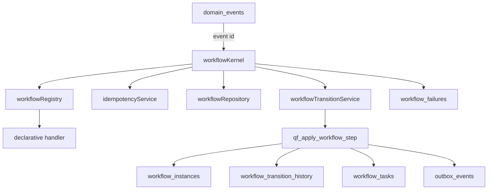

# QF Workflow Kernel v1 - Phase 1B

Phase 1B adds the generic Workflow Kernel and server-side persistence services. It does not connect real QuickFurno lead flow, lead scoring, clarification, matching, assignment, credits, WhatsApp, production n8n, client UI, vendor UI, admin UI, PM2, or any always-running worker.

Migration created:

`supabase/migrations/20260706000147_workflow_kernel_atomic_step.sql`

The migration was created for review and was not automatically applied to production.

## Architecture

## Module Responsibilities

| Module | Responsibility |
| --- | --- |
| `workflowTypes.ts` | Generic contracts for definitions, handlers, transitions, tasks, outbox commands, kernel results, failures, and retry decisions. |
| `workflowState.ts` | Pure transition-map validation and terminal status helpers. |
| `workflowRepository.ts` | Server-side workflow instance create/find/get through `adminClient()`. |
| `workflowTransitionService.ts` | Validates transitions and calls the atomic workflow-step RPC. |
| `workflowTaskService.ts` | Enqueues, claims, completes, retries, fails, dead-letters, and inspects workflow tasks. No polling loop. |
| `domainEventService.ts` | Creates/fetches domain events, acquires event ownership, marks failed/dead-letter. |
| `outboxService.ts` | Creates and tracks command intents only. It does not execute providers. |
| `idempotencyService.ts` | Wraps Phase 1A idempotency RPC and completes/fails operation records. |
| `retryPolicy.ts` | Deterministic retry policy with capped exponential-like backoff and no randomness. |
| `failureRedaction.ts` / `failureService.ts` | Redacts sensitive fields and persists safe failure summaries. |
| `workflowRegistry.ts` | In-memory registry of code definitions and handler references only. |
| `workflowKernel.ts` | Generic event-by-id orchestration flow. |
| `qfKernelTestWorkflow.ts` | Isolated mock workflow for tests only. |

## Database Transaction Boundary

Phase 1B adds `qf_apply_workflow_step(...)` to avoid partial commits such as state update without task/outbox creation.

The RPC atomically:

1. Locks and verifies `workflow_instances.id`.
2. Verifies expected current state.
3. Verifies expected workflow version.
4. Locks and verifies the triggering `domain_events` row is `processing`.
5. Updates workflow state, status, version, timestamps, and terminal `completed_at`.
6. Inserts `workflow_transition_history`.
7. Inserts next `workflow_tasks`.
8. Inserts `outbox_events`.
9. Marks the triggering domain event `processed`.
10. Returns the updated workflow instance.

State/version races raise `WORKFLOW_STATE_CONFLICT`.

Task and outbox idempotency keys are checked before insert. Existing same-scope task/outbox rows are skipped; materially different payload or scope raises a safe conflict (`WORKFLOW_TASK_IDEMPOTENCY_CONFLICT` or `OUTBOX_IDEMPOTENCY_CONFLICT`).

## Domain Event Ownership

Phase 1B adds `locked_at` and `locked_by` to `domain_events`.

`qf_acquire_domain_event(event_id, worker_id)` uses a conditional update:

- `pending -> processing` returns `acquired`.
- `processed` returns `already_processed`.
- `processing` raises `DOMAIN_EVENT_ALREADY_PROCESSING`.
- `failed` / `dead_letter` raises `DOMAIN_EVENT_NOT_PROCESSABLE`.

No in-memory lock is used.

## Workflow Registry

The registry stores workflow definitions and handler references in memory. It rejects duplicate registration and can list registered workflow types for diagnostics.

The registry is not durable workflow state. Durable state lives in PostgreSQL tables created in Phase 1A.

## Handler Contract

Handlers receive:

- current workflow record
- triggering domain event record
- workflow definition
- current timestamp

Handlers return declarative results:

- `nextState`
- optional `workflowStatus`
- optional `reason`
- optional metadata
- zero or more task requests
- zero or more outbox command requests

Handlers must not write to the database, call WhatsApp, call n8n, assign vendors, deduct credits, or perform lead scoring/matching.

## State and Version Strategy

`workflowState.ts` validates allowed `from -> to` transitions using a generic transition map. The database RPC verifies optimistic concurrency through:

- expected current state
- expected workflow version

The RPC increments `version` by 1 on success.

## Task Lifecycle

Task service supports:

- enqueue immediate/scheduled task
- claim one due task through `qf_claim_due_workflow_task`
- mark completed
- schedule retry
- mark failed
- mark dead-letter
- inspect stale `processing` rows for future recovery

No worker loop is started in Phase 1B.

## Retry Policy

Default policy:

- max attempts: 5
- attempt 1: 1 minute
- attempt 2: 5 minutes
- attempt 3: 15 minutes
- attempt 4: 1 hour
- attempt 5: dead-letter

The policy is deterministic and has no random jitter or infinite loop.

## Failure Sanitization

Failure metadata redacts keys matching:

`authorization`, `cookie`, `set-cookie`, `api_key`, `apikey`, `access_token`, `refresh_token`, `service_role`, `secret`, `password`

Error messages are capped and bearer tokens are masked. Full stack traces and raw request objects should not be persisted.

## Dead-Letter Strategy

Non-retryable failures and exhausted retry attempts move tasks/outbox items to `dead_letter`. Domain events may be marked `dead_letter` by the kernel when a non-retryable processing failure occurs.

Dead-letter rows are retained for audit and review; they are not deleted.

## Outbox Responsibility

`outboxService.ts` creates and tracks external command intents only. Phase 1B does not execute providers and does not call WhatsApp, Meta, n8n, email, SMS, or any third-party API.

The mock command type is `test.noop`.

## Mock Workflow

`qf_kernel_test` is isolated from real leads, vendors, assignments, credits, WhatsApp, and n8n.

States:

`CREATED -> READY -> PROCESSING -> COMPLETED`

Failure path:

`PROCESSING -> FAILED`

It demonstrates:

- event to workflow transition
- next task creation
- `test.noop` outbox command intent

## Optional Runtime DB Harness

`npm run test:phase1b:runtime` requires `QF_WORKFLOW_TEST_DATABASE_URL`.

If the variable is missing, tests are skipped honestly. The harness refuses obvious production/live database names and remote hosts unless `QF_WORKFLOW_TEST_ALLOW_REMOTE=true`.

Current local validation does not prove real concurrent PostgreSQL execution unless a safe test database is configured and reachable.

## Current Limitations

- No real lead flow connection.
- No production worker.
- No n8n production activation.
- No WhatsApp sending.
- No provider execution.
- No lead scoring/matching/assignment logic inside the Kernel.

## Future Phase 2 Direction

Future phases can register real QuickFurno workflow definitions that orchestrate existing authoritative domain services. The Kernel should coordinate those services but must not duplicate their business logic.

