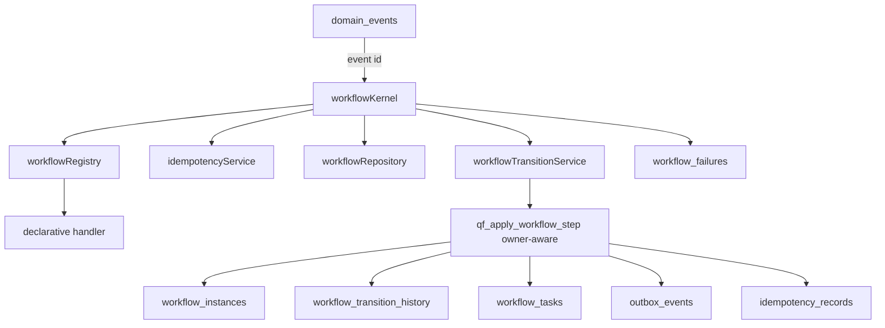

# QF Workflow Kernel v1 - Phase 1B

Phase 1B adds the generic Workflow Kernel and server-side persistence services. It does not connect real QuickFurno lead flow, lead scoring, clarification, matching, assignment, credits, WhatsApp, production n8n, client UI, vendor UI, admin UI, PM2, or any always-running worker.

Migrations created:

- `supabase/migrations/20260706000147_workflow_kernel_atomic_step.sql`
- `supabase/migrations/20260706000148_workflow_kernel_safety_hardening.sql`

The migrations were created for review and were not automatically applied to production.

## Architecture

## Module Responsibilities

| Module | Responsibility |
| --- | --- |
| `workflowTypes.ts` | Generic contracts for definitions, handlers, transitions, tasks, outbox commands, kernel results, failures, and retry decisions. |
| `workflowState.ts` | Pure transition-map validation and terminal status helpers. |
| `workflowRepository.ts` | Server-side workflow instance create/find/get through `adminClient()`, including unique-race refetch. |
| `workflowTransitionService.ts` | Validates transitions and calls the owner-aware atomic workflow-step RPC. |
| `workflowTaskService.ts` | Enqueues, claims, completes, retries, fails, dead-letters, and inspects workflow tasks. Claimed task mutations require `processing + locked_by`. |
| `domainEventService.ts` | Creates/fetches domain events, acquires event ownership, schedules retry, and dead-letters owned events. |
| `outboxService.ts` | Creates and tracks command intents only. Lifecycle mutations require worker ownership. It does not execute providers. |
| `idempotencyService.ts` | Wraps Phase 1A idempotency RPC and supports operation failure/lookup. Successful kernel completion is now handled inside the atomic step. |
| `retryPolicy.ts` | Deterministic retry policy with capped exponential-like backoff and no randomness. |
| `failureRedaction.ts` / `failureService.ts` | Redacts sensitive keys and secret-like strings, then persists safe failure summaries. |
| `workflowRegistry.ts` | In-memory registry of code definitions and handler references only. |
| `workflowKernel.ts` | Generic event-by-id orchestration flow. |
| `qfKernelTestWorkflow.ts` | Isolated mock workflow for tests only. |

## Database Transaction Boundary

Phase 1B uses `qf_apply_workflow_step(...)` to avoid partial commits such as state update without task/outbox creation.

The corrected owner-aware RPC atomically:

1. Validates worker identity.
2. Locks and verifies `workflow_instances.id`.
3. Verifies expected current state.
4. Verifies expected workflow version.
5. Locks and verifies the triggering `domain_events` row is `processing`.
6. Verifies `domain_events.locked_by = workerId`.
7. Updates workflow state, status, version, timestamps, and terminal `completed_at`.
8. Inserts `workflow_transition_history`.
9. Inserts next `workflow_tasks`.
10. Inserts `outbox_events`.
11. Marks the triggering domain event `processed`.
12. Completes the kernel idempotency record when an idempotency key is supplied.
13. Returns the updated workflow instance.

State/version races raise `WORKFLOW_STATE_CONFLICT`. Event ownership mismatches raise `DOMAIN_EVENT_OWNERSHIP_CONFLICT`.

Task and outbox idempotency keys are checked before insert. Existing same-scope task/outbox rows are skipped; materially different definitions raise `WORKFLOW_TASK_IDEMPOTENCY_CONFLICT` or `OUTBOX_IDEMPOTENCY_CONFLICT`.

Task idempotency comparison now includes `workflow_instance_id`, `task_type`, `payload_json`, `priority`, `max_attempts`, and explicit `due_at`. Omitted `due_at` uses the function timestamp for insertion and does not create a false mismatch against an existing defaulted task.

## Domain Event Ownership

`domain_events` has `locked_at`, `locked_by`, `attempt_count`, `max_attempts`, and `next_retry_at`.

`qf_acquire_domain_event(event_id, worker_id, stale_lock_after)` uses a conditional update:

- `pending -> processing` returns `acquired`.
- due `retry_scheduled -> processing` returns `acquired`.
- stale `processing -> processing` with a new owner returns `acquired`.
- active `processing` returns `already_processing` without mutation.
- `processed` returns `already_processed`.
- future `retry_scheduled` returns `retry_not_due`.
- `failed` / `dead_letter` raises `DOMAIN_EVENT_NOT_PROCESSABLE`.

The Kernel treats `already_processing`, `already_processed`, and `retry_not_due` as non-mutating outcomes. A duplicate caller does not fail, dead-letter, unlock, or apply a step for another worker's event.

## Domain Event Retry Lifecycle

Durable lifecycle:

`pending -> processing -> retry_scheduled -> processing -> processed`

Terminal paths:

- non-retryable owned failure -> `dead_letter`
- retry exhaustion -> `dead_letter`

Retryable handler failures use `calculateRetryDecision(...)` and call `qf_schedule_domain_event_retry(...)`, which requires `processing + locked_by = workerId`. Terminal failures call `qf_dead_letter_domain_event(...)`, also owner-aware.

## Stale Event Recovery

No cron, polling loop, or production worker is added in Phase 1B.

Stale recovery is supported at acquisition time only when `processing.locked_at <= now() - stale_lock_after`. The stale interval must be positive and the worker ID must be nonblank. Active locks cannot be stolen.

Future workers can tune `stale_lock_after` by deployment configuration. Phase 1B does not run an automatic recovery job.

## Workflow Registry

The registry stores workflow definitions and handler references in memory. It rejects duplicate registration and can list registered workflow types for diagnostics.

The registry is not durable workflow state. Durable state lives in PostgreSQL tables created in Phase 1A.

## Handler Contract

Handlers receive:

- current workflow record
- triggering domain event record
- workflow definition
- current timestamp

Handlers return declarative results:

- `nextState`
- optional `workflowStatus`
- optional `reason`
- optional metadata
- zero or more task requests
- zero or more outbox command requests

Handlers must not write to the database, call WhatsApp, call n8n, assign vendors, deduct credits, or perform lead scoring/matching.

## State and Version Strategy

`workflowState.ts` validates allowed `from -> to` transitions using a generic transition map. The database RPC verifies optimistic concurrency through expected current state and expected workflow version. The RPC increments `version` by 1 on success.

`workflowRepository.getOrCreateWorkflowInstance(...)` remains protected by the Phase 1A partial unique index. If two workers race, the loser only swallows the expected `uq_workflow_instances_active_entity` unique conflict, refetches the active winner, and rethrows unrelated database errors.

## Task Lifecycle

Task service supports:

- enqueue immediate/scheduled task
- claim one due task through `qf_claim_due_workflow_task`
- mark completed
- schedule retry
- mark failed
- mark dead-letter
- inspect stale `processing` rows for future recovery

Claimed task mutations now require:

`status = processing AND locked_by = workerId`

If no row is updated, the service raises `WORKFLOW_TASK_OWNERSHIP_CONFLICT`.

No worker loop is started in Phase 1B.

## Outbox Responsibility

`outboxService.ts` creates and tracks external command intents only. Phase 1B does not execute providers and does not call WhatsApp, Meta, n8n, email, SMS, or any third-party API.

Outbox lifecycle mutations require worker ownership:

- `processing + locked_by -> sent`
- `sent + locked_by -> completed`
- `processing + locked_by -> retry_scheduled/dead_letter/failed`

If no row is updated, the service raises `OUTBOX_OWNERSHIP_CONFLICT`.

The mock command type is `test.noop`.

## Retry Policy

Default policy:

- max attempts: 5
- attempt 1: 1 minute
- attempt 2: 5 minutes
- attempt 3: 15 minutes
- attempt 4: 1 hour
- attempt 5: dead-letter

The policy is deterministic and has no random jitter or infinite loop.

## Failure Sanitization

Failure metadata redacts keys matching:

`authorization`, `cookie`, `set-cookie`, `api_key`, `apikey`, `access_token`, `refresh_token`, `service_role`, `secret`, `password`

Error strings also mask common bearer tokens, authorization headers, `password=...`, `api_key=...`, `access_token=...`, `refresh_token=...`, `service_role=...`, `secret=...`, database URLs containing credentials, and JWT-like tokens.

Full stack traces and raw request objects should not be persisted.

## Successful Step and Idempotency Completion

The correction moves successful kernel idempotency completion into `qf_apply_workflow_step(...)`. This prevents the edge case where the workflow step commits, the event is marked processed, and a later application-side idempotency completion failure incorrectly sends the event through the failure path.

If the atomic step commits, the event is already processed and the idempotency record is completed in the same transaction.

## Mock Workflow

`qf_kernel_test` is isolated from real leads, vendors, assignments, credits, WhatsApp, and n8n.

States:

`CREATED -> READY -> PROCESSING -> COMPLETED`

Failure path:

`PROCESSING -> FAILED`

It demonstrates:

- event to workflow transition
- next task creation
- `test.noop` outbox command intent

## Optional Runtime DB Harness

`npm run test:phase1b:runtime` requires `QF_WORKFLOW_TEST_DATABASE_URL`.

If the variable is missing, tests are skipped honestly:

`RUNTIME DB CONCURRENCY TESTS: SKIPPED - NO SAFE TEST DB CONFIGURED`

The harness refuses obvious production/live database names and remote hosts unless `QF_WORKFLOW_TEST_ALLOW_REMOTE=true`.

If only a connection smoke test is performed, it reports:

- `DB CONNECTION SMOKE: PASSED`
- `RUNTIME DB CONCURRENCY TESTS: NOT RUN`

It must not claim runtime concurrency passed from a smoke connection. Real concurrent PostgreSQL scenarios still require an applied safe local/staging test database.

## Current Limitations

- No real lead flow connection.
- No production worker.
- No n8n production activation.
- No WhatsApp sending.
- No provider execution.
- No lead scoring/matching/assignment logic inside the Kernel.
- Runtime DB concurrency checks are skipped unless an explicit safe test database is configured.

## Future Phase 2 Direction

Future phases can register real QuickFurno workflow definitions that orchestrate existing authoritative domain services. The Kernel should coordinate those services but must not duplicate their business logic.
